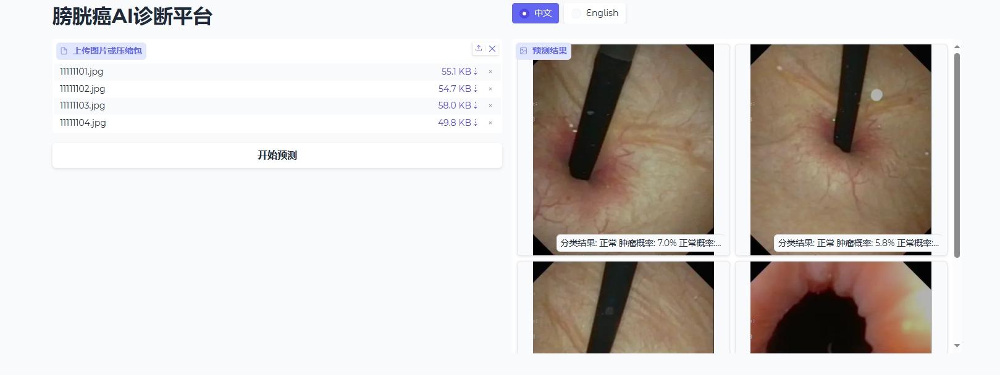

#  Bladder Tumor Analysis from Cystoscopy Images

本项目基于膀胱镜图像，旨在实现针对膀胱肿瘤的多任务智能分析。  
通过分类、分割与分级预测模型，辅助膀胱癌的早期发现和精准诊断。

---
##  在线推理平台

项目提供了一个在线平台，支持用户：

- 上传单张膀胱镜图像（`jpg/png`格式）
- 或批量上传压缩包（`zip`格式）
- 平台自动完成图像解析，执行分类、分割与分级预测，并返回结果下载。
  
---
##  项目任务
### Task 1: 肿瘤分类（Tumor Classification）
- **目标**：根据膀胱镜图像判断图像中是否存在肿瘤。
- **输出**：二分类结果（`Normal` / `Tumor`）。
- **框架**：尝试了convnext_tiny,efficient_b0和swin-tiny。
- **结果**：swin_tiny可以达到AUC:96.44%;F1 score:80.9%。
### Task 2: 肿瘤分割（Tumor Segmentation）
- **目标**：在膀胱镜图像中定位并分割出肿瘤区域。
- **输出**：每张图像对应一张掩膜（Mask），掩盖肿瘤区域。
- **框架**：尝试了Unetpp+Resnet34和Unetpp+Resnet50。
- **结果**：暂时效果最好的是Unetpp+Resnet50的baseline，后续尝试提升性能。Dice：81%;IoU:72.5%。
### Task 3: 肿瘤分级（Tumor Grading）
- **目标**：对于检测到肿瘤的图像，进一步分类为：
  - `低级别 (Low-grade)`
  - `高级别 (High-grade)`
- **输出**：分级标签。
- **框架**：使用了ConvNeXt-Tiny；
- **结果**：AUC：89.6%。

